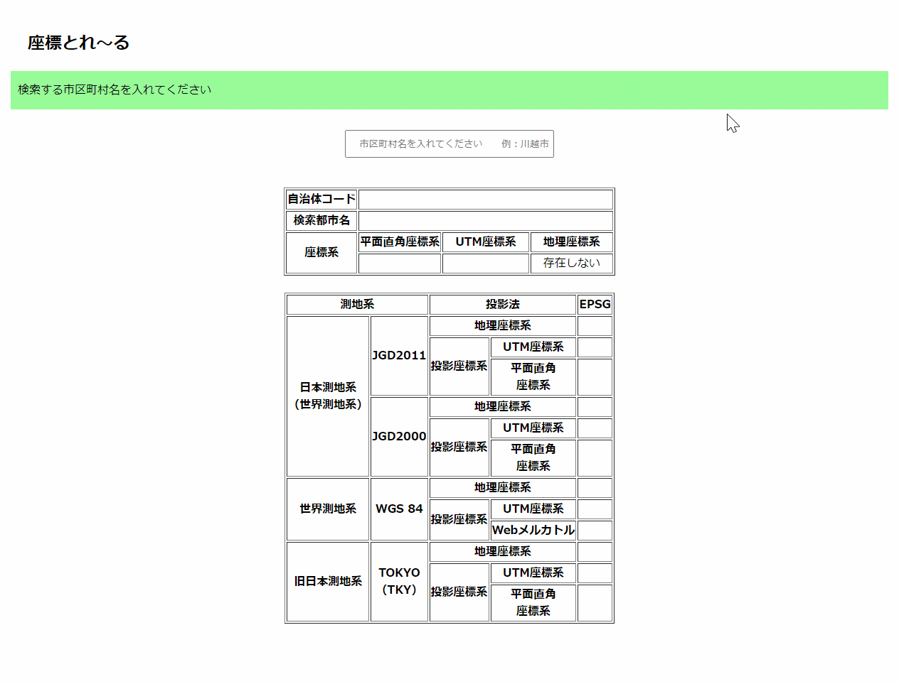

# 座標とれ～る
[サイトURL](https://new-flathill.github.io/)

## ・作成に至った経緯
      GIS等を触っていて座標系をすぐ知りたい！そんな人に救いの手をと思い作成したサイトです！

## ・このサイトで確認できる内容
      JGD2000, JGD2011, WGS 84, TKY それぞれの地理座標系、平面直角座標系、UTM座標系

## ・マニュアル（やわらか～く、ポップに）
      ・入力欄に市区町村名を入力し、ENTERを押すことで下記の表に情報が自動入力されるよ（なんて簡単なんだ！）
      
      
      
      ・入力欄を再度選択すると、中の文字が全選択された状態になってるよ（次の検索も楽々だね！）
      
      ・都市名が複数ある場合は、プルダウン形式で候補が出てくるよ（1つでも出てきちゃうのが玉に瑕...）
      
      ・市区町村名を間違えた時はエラー文が出てくるよ（赤文字だけどびっくりしないでね...）
      
